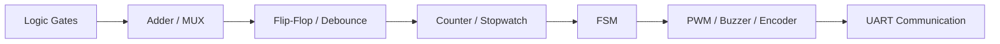

<div align="center">

# ⚡ FPGA & Verilog Practice

### Verilog 기초부터 주변장치 제어와 UART 통신까지

Vivado와 Basys 3 FPGA 보드를 사용해 디지털 회로의 기본 개념을 익히고,<br>
직접 설계·시뮬레이션·합성하며 진행한 FPGA 실습 모음입니다.

</div>

---

## 📌 Repository Overview

이 저장소에는 조합 논리 회로부터 순차 논리 회로, FSM, PWM, 센서 입력 처리 및 UART 통신까지 학습하며 작성한 **Verilog HDL 실습 프로젝트**가 정리되어 있습니다.

각 폴더는 독립적인 Vivado 프로젝트이며, 대부분 다음과 같은 흐름으로 실습했습니다.

```text
Verilog 모듈 설계
  → Testbench 작성 및 Behavioral Simulation
  → Basys 3 핀 설정(XDC)
  → Synthesis / Implementation
  → FPGA 보드 동작 확인
```

| 구분 | 내용 |
| --- | --- |
| 개발 언어 | Verilog HDL |
| 개발 도구 | Xilinx Vivado |
| 실습 보드 | Digilent Basys 3 |
| 주요 입출력 | Switch, Push Button, LED, 7-Segment Display |
| 주변장치 | DC Motor, Piezo Buzzer, Rotary Encoder, UART |
| 주요 학습 내용 | 조합·순차 논리, Clock Divider, Debouncing, FSM, PWM, Serial Communication |

---

## 🧭 Learning Path



---

## 📂 Practice Projects

### 1. Digital Logic Basics

| 폴더 | 실습 내용 |
| --- | --- |
| [`01_gates_test`](./01_gates_test/) | AND, OR, NAND, NOR, XOR 기본 논리 게이트의 출력을 LED로 확인한 실습 |
| [`02.adder`](./02.adder/) | Half Adder를 설계하고 두 개의 Half Adder를 조합해 Full Adder를 구현한 실습 |
| [`02_1.adder4`](./02_1.adder4/) | Full Adder를 직렬로 연결한 4비트 Ripple Carry Adder 실습 |
| [`03.add4_sub4`](./03.add4_sub4/) | 2의 보수를 이용해 선택 신호에 따라 덧셈과 뺄셈을 수행하는 연산 회로 실습. 현재 소스는 6비트 연산으로 확장되어 있음 |
| [`04.mux_decoder_encoder`](./04.mux_decoder_encoder/) | 4비트 2:1 MUX, 2-to-4 Decoder, 4-to-2 Priority Encoder 설계 및 테스트 |
| [`05_adder8`](./05_adder8/) | Full Adder 8개를 연결해 만든 8비트 Ripple Carry Adder 실습 |

### 2. Button Input & Sequential Logic

| 폴더 | 실습 내용 |
| --- | --- |
| [`05.btn_debounce_2ff`](./05.btn_debounce_2ff/) | 저주파 샘플링과 2단 D Flip-Flop을 이용해 버튼 채터링을 제거하고, 버튼 입력을 단일 펄스로 변환한 실습 |
| [`05.my_btn_debounce`](./05.my_btn_debounce/) | Clock Divider, Debounce, LED Toggle 구조를 직접 다시 구성해 본 개인 실습 |
| [`06.up_down_counter`](./06.up_down_counter/) | 버튼으로 Up/Down/Switch 모드를 전환하고 값을 4자리 7-Segment Display에 출력하는 카운터 |
| [`07.min_sec_stopwatch`](./07.min_sec_stopwatch/) | 분·초 시계와 초·1/100초 스톱워치 구현. 시작·정지·초기화 및 대기 애니메이션 기능 포함 |

### 3. FSM & Pattern Detection

| 폴더 | 실습 내용 |
| --- | --- |
| [`09.coffee_machine`](./09.coffee_machine/) | 동전 투입, 금액 확인, 커피 제조, 잔액 반환 과정을 상태로 나눈 커피 자판기 FSM 실습 |
| [`09.coffee_machine_my`](./09.coffee_machine_my/) | 커피 자판기 상태 전이와 금액 처리 로직을 별도 프로젝트에서 다시 검증한 실습 |
| [`09.my_coffee_machine`](./09.my_coffee_machine/) | 자판기 FSM에 버튼 Debounce, 금액 FND 표시, 커피 제조 애니메이션을 결합한 개인 확장 버전 |
| [`10.fsm_pattern`](./10.fsm_pattern/) | Mealy FSM으로 직렬 입력에서 `1010111` 비트 패턴을 검출하는 실습 |
| [`10.my_fsm_pattern`](./10.my_fsm_pattern/) | 상태 전이를 직접 구성해 `0110` 비트 패턴을 검출한 개인 실습 |
| [`11.shift_register`](./11.shift_register/) | 7비트 Shift Register에 입력을 순차 저장하고 `1010111` 패턴과 비교하는 검출 방식 실습 |

### 4. Peripheral Control

| 폴더 | 실습 내용 |
| --- | --- |
| [`11.pwm_dcmotor`](./11.pwm_dcmotor/) | PWM Duty Cycle을 버튼으로 조절하고 정·역회전 신호를 출력하는 DC Motor 제어 실습 |
| [`11.my_pwm_dcmotor`](./11.my_pwm_dcmotor/) | DC Motor 제어에 현재 Duty Cycle과 회전 방향을 표시하는 4자리 FND 기능을 추가한 버전 |
| [`12.piezo_buzzer`](./12.piezo_buzzer/) | Clock 분주로 여러 음계의 주파수를 만들고 버튼에 따라 Piezo Buzzer를 울리는 실습 |
| [`12.my_make_buzzer`](./12.my_make_buzzer/) | 버튼 입력 시 서로 다른 네 단계의 주파수를 일정 시간마다 순서대로 재생하는 개인 멜로디 실습 |
| [`13.2stage_ff_play_melody`](./13.2stage_ff_play_melody/) | Buzzer 입력 앞에 2단 Flip-Flop Synchronizer를 추가해 비동기 버튼 신호를 안정적으로 처리한 실습 |
| [`13.microwave`](./13.microwave/) | 전자레인지의 전원·시간 추가·문 열림·취소 입력과 Buzzer 출력을 구상한 프로젝트 골격. 제어 로직은 작성 중인 상태 |
| [`14.rotary_encoder`](./14.rotary_encoder/) | Rotary Encoder의 Quadrature 신호로 회전 방향을 판별하고 8비트 값을 증감하며, Key 입력으로 LED를 Toggle하는 실습 |

### 5. UART Communication

| 폴더 | 실습 내용 |
| --- | --- |
| [`15.uart`](./15.uart/) | 9600 bps UART TX/RX 구현. TX는 ASCII 데이터를 전송하고 RX는 16배 Oversampling으로 데이터를 수신해 제어 로직과 연결 |
| [`15_1.my_uart_tx`](./15_1.my_uart_tx/) | 버튼을 누를 때마다 `P`, `J`, `H` 문자를 차례대로 보내는 UART TX 중심의 개인 실습 |

---

## ✨ What I Practiced

- `assign`, `always`, `case`를 이용한 조합 논리 회로 설계
- D Flip-Flop, Counter, Shift Register를 이용한 순차 논리 설계
- Clock Divider와 Tick Generator를 이용한 시간 제어
- Button Debouncing, Edge Detection, 2-FF Synchronizer 구현
- Binary/BCD 변환과 4자리 7-Segment Dynamic Display 제어
- Mealy FSM을 이용한 패턴 검출 및 자판기 제어
- PWM Duty Cycle 조절을 통한 DC Motor 속도 제어
- 주파수 분주를 이용한 Piezo Buzzer 음계 생성
- Rotary Encoder의 Gray Code 상태 변화 해석
- UART TX/RX 상태 머신과 16배 Oversampling 수신 구조 구현

---

## 🗂️ Vivado Project Structure

각 실습 폴더에는 Vivado가 생성한 프로젝트 파일과 소스가 함께 들어 있습니다.

```text
<project>/
├── <project>.xpr                  # Vivado 프로젝트 파일
├── <project>.srcs/
│   ├── sources_1/                 # Verilog 설계 소스
│   ├── sim_1/                     # Testbench
│   └── constrs_1/                 # Basys 3 핀 설정(XDC)
├── <project>.sim/                 # 시뮬레이션 결과
└── <project>.runs/                # 합성 및 구현 결과
```

> Vivado에서 실습을 확인하려면 원하는 폴더의 `.xpr` 파일을 열면 됩니다. 핵심 코드는 각 프로젝트의 `.srcs/sources_1/` 아래에서 확인할 수 있습니다.

---

## 📝 Notes

- 폴더명의 `my`는 수업 예제를 바탕으로 기능을 직접 추가하거나 다시 구현한 버전입니다.
- 일부 프로젝트에는 학습 중 작성한 주석, 이전 구현, 시뮬레이션 결과가 함께 남아 있습니다.
- `13.microwave`는 인터페이스와 일부 모듈만 구성된 미완성 실습입니다.

---

<div align="center">

### 작은 논리 회로부터 통신 시스템까지, FPGA 설계 흐름을 익히기 위한 실습 기록

</div>
